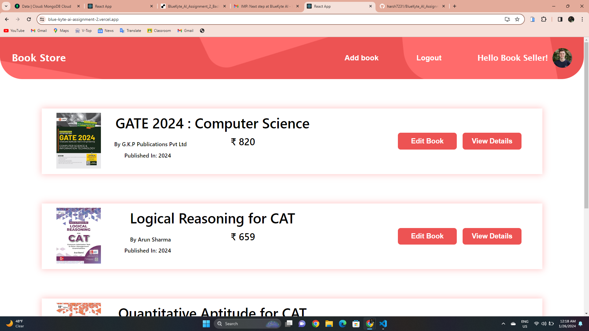
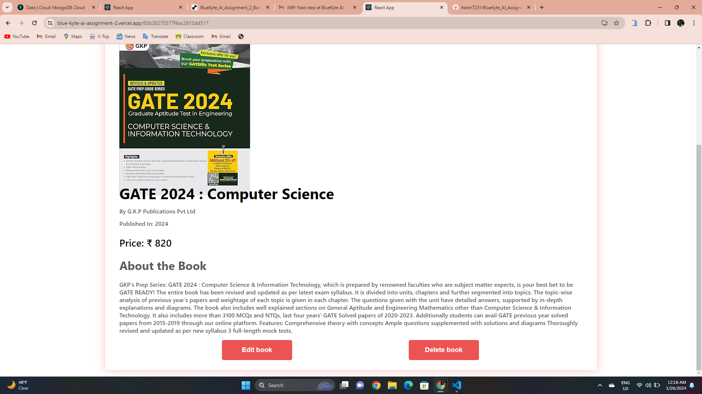
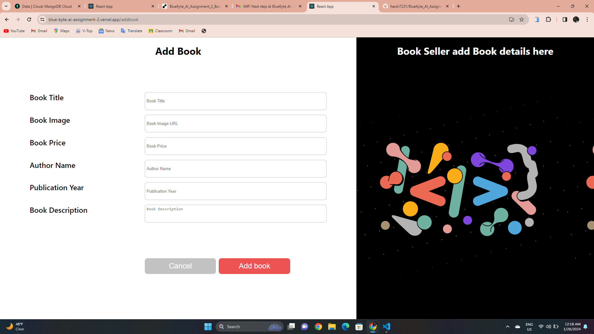

# Online Bookstore Frontend

- This is the frontend application for the Online Bookstore project. The application provides a user interface to interact with the RESTful API developed for managing a simple online bookstore. It is built using React.js, and the state management is facilitated through the context API.

- This project was bootstrapped with [Create React App](https://github.com/facebook/create-react-app).

## Table of Contents

- Features
- Project Structure
- Installation
- Usage
- Backend Development
- Screenshots
- Contributing
- License

## Features

1. View Books:

- Retrieve a list of books with details (title, author, publication year, etc.).

2. Add New Book:

- Add a new book to the database.

3. Update Book Details:

- Update details of an existing book.

4. Delete Book:

- Delete a book from the database.

5. User Authentication:

- User authentication is implemented for accessing certain functionalities.

## Project Structure

- `src/`: Contains the source code for the React application.
  - `components/`: React components for different parts of the application.
  - `context/`: Context API for state management.
  - `hooks/`: Custom hooks used in the application.
  - `assets/`: Images and other static assets.
  - `constants/`: Constants like API base URL.
  - `App.js`: Main application component.
- `public/`: Public assets and the HTML template.
- `package.json`: NPM package configuration.
- `README.md`: Documentation for the frontend.

## Installation

1. Clone the repository: -`git clone https://github.com/harsh7231/Book-Listing-Platform.git`

2. Navigate to the project directory:

- `cd Book-Listing-Platform`

3. Install dependencies:

- `npm install axios react-toastify`

## Usage

1. Start the development server:

- `npm start`

2. Open your browser and navigate to `http://localhost:3000`.

3. Interact with the online bookstore application.

## Backend Development

- The back-end application is a set of RESTful API.

- The back-end application github repository link is (https://github.com/harsh7231/Book-Listing-Platform-Backend)

## Screenshots

## Contributing

If you would like to contribute to this project, please open an issue or submit a pull request.

## License

This project is licensed under the MIT License.
